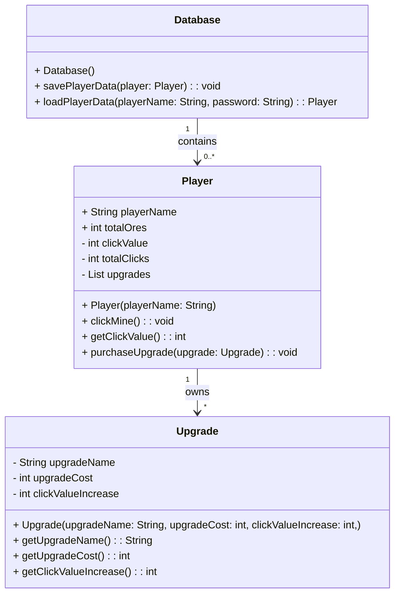
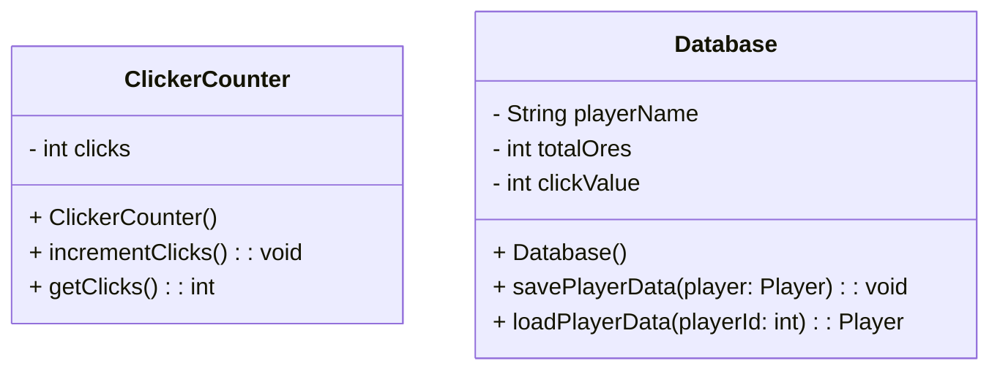

# Master Miner V1

This is a School examination project.
The Idea comes from the game "Cookie Clicker" + "RPG-TextGame" (bot from discord).
A collaboration will happen in GEOMETRY DASH as level and visual of this game among me and @IchorDragon, taking the concept from the GEOMETRY DASH Level: "Coin Temple".

You may dont want to copy my code since its not 100% working but for reviews and Concept stealing its allowed XD.
 
 
 
 
 

Task 1. UML-Milestone (create an UML-Diagram)

V V V V V V V V V V V V V V V V V V V V V

############################################

**Main program UML:**

############################################

############################################

**Main Data structure UML:**

############################################

