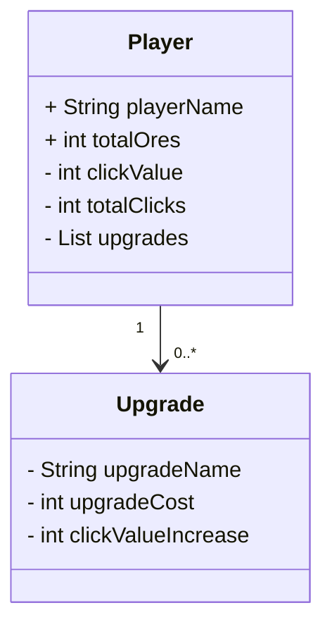
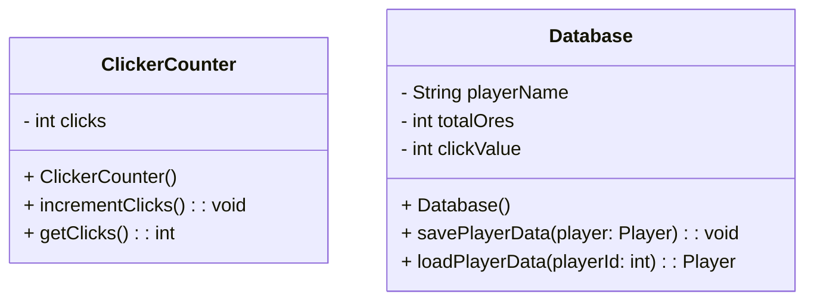

# Master Miner V1

This is a School examination project.
You may dont want to copy my code since its not 100% working but for reviews and Concept stealing its allowed XD.
<br>
<br>
<br>
<br>
<br>


Task 1. UML-Milestone (create an UML-Diagram)

V V V V V V V V V V V V V V V V V V V V V

############################################

**Main program UML:**

############################################





############################################

**Main Data structure UML:**

############################################




□□□□□□□□□□□□□□□□□□

```mermaid
classDiagram
    class Program {
        -db: DBconfig
        +Main(args: string[])
    }
    class Scripts {
        +Config()
        class Spielstand {
            +Auswahl(): int
            +CreateLoad(gameslot: int): Player
        }
        +GameLoop(player: Player)
        +Shop(player: Player)
    }
    class Player {
        -Ores: string
        -ClickVal: string
        -Links: List<Link>
        -GameSlot: int
    }
    class DBconfig {
        +Players: DbSet<Player>
        +Upgrades: DbSet<Upgrade>
    }
    class Link {
        -upgrade: Upgrade
        -player: Player
        -price: string
        -increasePercent: int
        -clickval: string
    }
    class Upgrade {
        -Id: int
        -Name: string
        -Cost: int
        -IncreasePercent: int
        -ClickVal: string
    }
```
